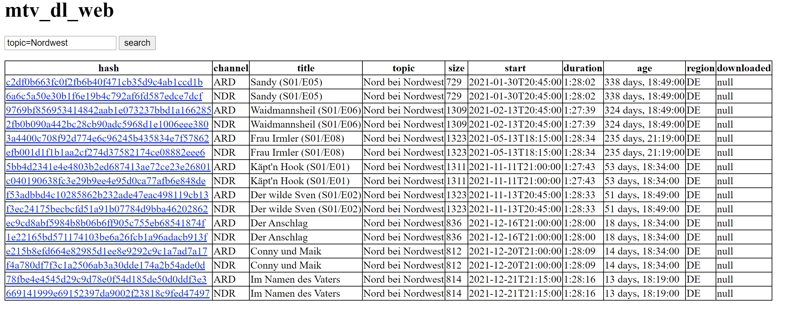

# mtv_dl_web

This is a proof-of-concept for a simple web-frontend for the awesome command
line tool [mtv_dl](https://github.com/fnep/mtv_dl). It allows you to browse the
Mediathek contents and download the videos to the server where this application
is running.

So this is different to [MediathekViewWeb](https://mediathekviewweb.de/), 
where the videos are downloaded to the client.

The search results are presented in a similar way as on the command line:

 
The current implementation is a very early prototype with lots of open security
issues. Only run in a trusted environment!

