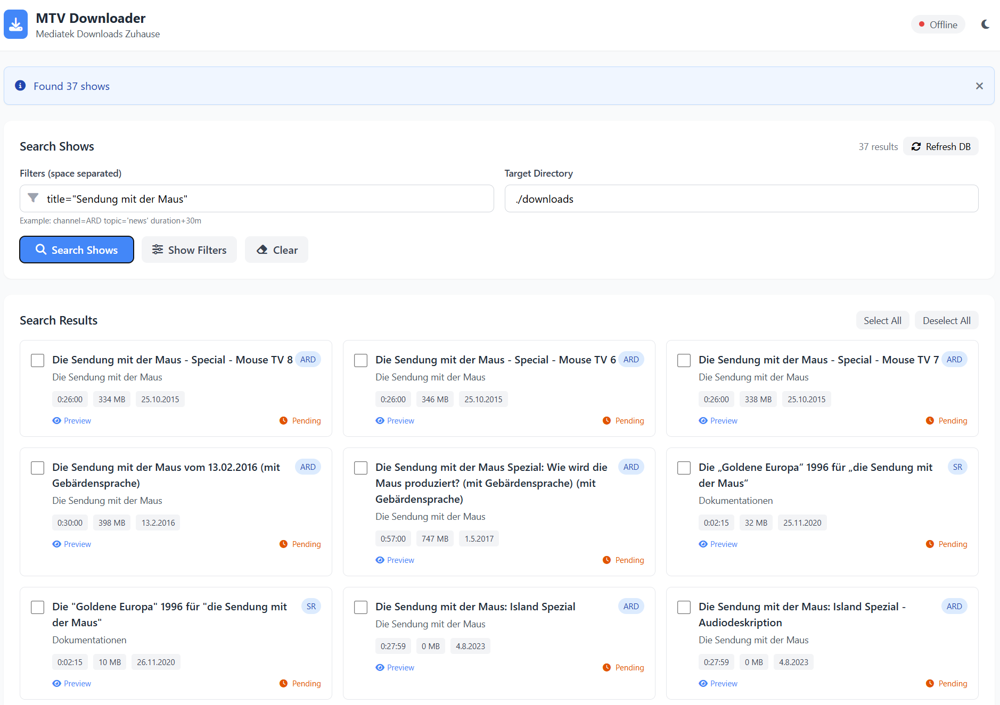

# MTV Downloader Web Interface

A small self-hosted web UI for [mtv_dl](https://github.com/fnep/mtv_dl), the MediathekView downloader. Run it on a server, mini PC, or NAS-adjacent machine, search the public broadcasting catalog "Mediathek" from a browser, and download shows directly into a mounted media folder so they are ready to watch from your NAS.

This project is mostly AI generated using the BMAD method for vibe coding: product notes, architecture, stories, and implementation context live in `_bmad-output/` so future agent sessions can keep working from the same plan. Expect sharp edges, but also a pleasantly direct path from idea to working software.



## What It Does

- Provides a FastAPI backend with a browser-based search and download interface.
- Reuses `mtv_dl` for database updates, filtering, and downloading instead of reimplementing MediathekView logic.
- Stores downloaded media in a host-mounted `/downloads` directory, which can point at local disk or NAS storage.
- Keeps application data, config, downloads, and the `mtv_dl` SQLite database outside the container so restarts do not wipe state.

## Quick Start

### Prebuilt Image from GHCR (Main Branch)

The main branch automatically publishes a container image to GitHub Container Registry:

- `ghcr.io/<username-or-org>/mtv_dl_web:latest`
- `ghcr.io/<username-or-org>/mtv_dl_web:main-<commit-sha>`

Replace `<username-or-org>` with the GitHub organization or user that owns this repository.

```bash
mkdir -p ./data ./downloads ./config

docker run -d -p 8000:8000 \
  -v "$(pwd)/data:/data" \
  -v "$(pwd)/downloads:/downloads" \
  -v "$(pwd)/config:/config" \
  --name mtv-dl-web \
  ghcr.io/<owner>/mtv_dl_web:latest
```

Equivalent Podman command:

```bash
mkdir -p ./data ./downloads ./config

podman run -d -p 8000:8000 \
  -v "$(pwd)/data:/data" \
  -v "$(pwd)/downloads:/downloads" \
  -v "$(pwd)/config:/config" \
  --name mtv-dl-web \
  ghcr.io/<owner>/mtv_dl_web:latest
```

Readiness and persistence verification:

```bash
curl http://localhost:8000/health
podman restart mtv-dl-web
curl http://localhost:8000/health
```

`GET /health` should remain healthy and mounted content persists across restart because `/data`, `/downloads`, and `/config` are external mounts.

### Docker Compose

```bash
docker-compose up -d
```

Open <http://localhost:8000>.

The compose file mounts these host directories into the container:

| Host path       | Container path              | Purpose                                 |
| --------------- | --------------------------- | --------------------------------------- |
| `./downloads`   | `/downloads`                | Downloaded video files                  |
| `./config`      | `/config`                   | Configuration files                     |
| `./data`        | `/data`                     | Application data, `filmliste.sqlite`, and download history |

To write directly to NAS storage, change the `./downloads:/downloads` mount in `docker-compose.yml` to a mounted NAS path, for example `/mnt/nas/mediathek:/downloads`.

### Docker

```bash
docker build -t mtv-dl-web .
mkdir -p ./data ./downloads ./config

docker run -d -p 8000:8000 \
  -v "$(pwd)/data:/data" \
  -v "$(pwd)/downloads:/downloads" \
  -v "$(pwd)/config:/config" \
  --name mtv-dl-web \
  mtv-dl-web
```

Open <http://localhost:8000>.

### Local Development

```bash
uv sync
uv run uvicorn mtv_dl_web.main:app --host 0.0.0.0 --port 8000
```

## Using The Web UI

1. Enter one or more filters in the **Filters** field.
2. Set the target directory. In Docker this should usually be `/downloads` or a subdirectory like `/downloads/tatort`.
3. Click **Search Shows**.
4. Select the results you want.
5. Choose quality and subtitle options.
6. Click **Download Selected Shows**.

The first start may take longer because `mtv_dl` needs a local copy of the MediathekView film list.

## Filter Queries

Filters use the same basic syntax as `mtv_dl`:

```text
field<operator>value
```

Examples:

```text
channel=ARD
topic='extra 3' duration+20m age-1w
title!=spezial duration+45m
topic=Tatort dow=0 hour=20
```

Multiple filters are combined with **AND**, so every filter must match. Quote values that contain spaces, such as `topic='Die Anstalt'`.

Supported operators:

| Operator | Meaning                                                  |
| -------- | -------------------------------------------------------- |
| `=`      | Contains or equals, depending on the field type          |
| `!=`     | Does not contain or does not equal                       |
| `+`      | Greater than for numeric, age, and duration-style fields |
| `-`      | Less than for numeric, age, and duration-style fields    |

Supported fields include `description`, `region`, `size`, `channel`, `topic`, `title`, `hash`, `url`, `duration`, `age`, `start`, `dow`, `hour`, `minute`, `season`, and `episode`.

 Useful patterns:

- `duration+20m` finds shows longer than 20 minutes.
- `age-1w` finds shows newer than one week.
- `channel=ZDF topic=heute-show` finds ZDF shows whose topic contains `heute-show`.
- `topic=Tatort dow=0 hour=20` finds Sunday evening Tatort-style matches.

## Configuration

### Supported Parameters

The application supports configuration through environment variables and a YAML config file (typically `/config/config.yaml` in Docker).

| Parameter in implementation | Key in `config.yaml` | Environment variable | Default | Semantics |
| --------------------------- | -------------------- | -------------------- | ------- | --------- |
| `port` | `port` | `PORT` | `8000` | HTTP port the FastAPI service listens on. |
| `host` | `host` | `HOST` | `0.0.0.0` | Network interface address the service binds to. |
| `database_path` | `database_path` | `DATABASE_PATH` | `~/.mtv_dl_web` | Path for mtv_dl data storage. If it is a directory, files like `filmliste.sqlite` and `history.sqlite` are created there; if it is a file path, that file is used for the film list and `history.sqlite` is placed in its parent directory. |
| `download_quality` | `download_quality` | `DOWNLOAD_QUALITY` | `best` | Default quality profile passed to downloads. |
| `target_directory` | `target_directory` | `TARGET_DIRECTORY` | `/downloads` | Default output directory for downloaded media. |
| `enable_subtitles` | `enable_subtitles` | `ENABLE_SUBTITLES` | `true` | Default for subtitle download in the UI/API. |
| `enable_nfo` | `enable_nfo` | `ENABLE_NFO` | `true` | Default for writing NFO metadata in the UI/API. |
| `enable_mkv_merge` | `enable_mkv_merge` | `ENABLE_MKV_MERGE` | `false` | Default for merging outputs to MKV in the UI/API. |
| `config_file` | `config_file` | `CONFIG_FILE` | `null` | Optional path to a YAML config file loaded at startup. |
| `(logging level)` | n/a | `LOG_LEVEL` | `INFO` | Python logging level for application logs (`DEBUG`, `INFO`, `WARNING`, etc.). |
| `(skip request-time DB update check)` | n/a | `MTV_DL_WEB_SKIP_DB_UPDATE` | unset | When set to `1`, skips request-time database update check code paths. |

### Configuration File (`config.yaml`) Example

```yaml
port: 8000
host: 0.0.0.0
database_path: /data/filmliste.sqlite
download_quality: best
target_directory: /downloads
enable_subtitles: true
enable_nfo: true
enable_mkv_merge: false
```

#### Configuration Priority

Configuration values are loaded in the following priority order (highest to lowest):
1. Environment variables (e.g., `PORT=8080`)
2. `config.yaml` file values
3. Default values

`database_path` supports both a directory path and a file path, as described in the table above.

## API Endpoints

- `GET /` - Main web interface
- `GET /health` - Health check
- `POST /api/search` - Search for shows with filters
- `POST /api/download` - Start downloads for matching shows
- `GET /api/download/status/{download_id}` - Get one download status
- `GET /api/download/status` - Get all download statuses

Example search request:

```bash
curl -X POST http://localhost:8000/api/search \
  -H "Content-Type: application/json" \
  -d '{"filters":["channel=ARD","topic='\''extra 3'\''","duration+20m"]}'
```

## Development

```bash
pytest tests/
black src/ tests/
mypy src/ tests/
npx prettier --check "src/mtv_dl_web/frontend/**/*.html"
```

## Running Locally

For local development, you can use the provided run script which will:
1. Install dependencies using uv
2. Activate the project environment
3. Run the service with uvicorn using the config.yaml in the current directory

```bash
./scripts/run.sh
```

## Credits

This web interface stands on top of [mtv_dl](https://github.com/fnep/mtv_dl). Thank you to the `mtv_dl` maintainers for doing the hard part: integrating with the MediathekView data and downloader workflow so this project can stay focused on a small self-hosted UI.

## Security

This service is intended to be run behind a reverse proxy that handles user authentication. It does not have a built-in authentication mechanism. 

⚠️ **This service is NOT meant to be exposed directly to the public internet** and is not hardened against any attacks. It should only be accessed from trusted networks or behind proper authentication and authorization controls.

## License

MIT License.
