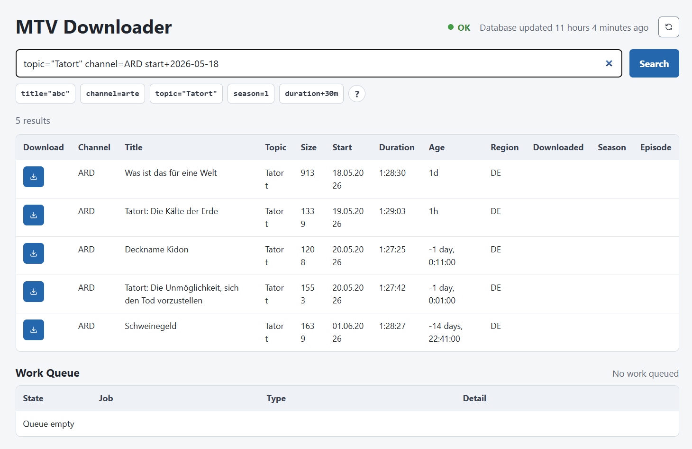

# mtv_dl_web
A light-weight web UI wrapper for [mtv_dl](https://github.com/fnep/mtv_dl). Thank you @fnep for creating this awesome tool! mtv_dl_web runs on your home lab and downloads the shows to your NAS. 

The web UI looks like this:


## Deployment

This deployment assumes you know how to deploy containers and have a computer on your home (or somewhere else) where you can deploy containers. It also assumes you understand and accept the risks of deploying open source software in that environment.

This service was mostly implemented by AI, so it will behave weird in some cases.

⚠️ This service must be run behind a reverse proxy with authentication. Don't put it blindly in the public Internet!

### Run as container

The service listens on port `8071` inside the container and expects three mounted directories:

- `/config`: contains `mtv_dl_web.yaml` config file
- `/downloads`: where downloaded shows are written
- `/database`: where the `mtv_dl` database is stored

The container runs as the non-root user `mtvdlweb` with UID/GID `10001`.
The mounted `/downloads` and `/database` directories must be writable by that
user. `/config` only needs to be readable unless the config file is created from
inside the container.

Container images are published to the [GitHub Container Registry](<https://github.com/ChristianKuehnel/mtv_dl_web/pkgs/container/mtv_dl_web>). Users should pull the published container image directly from GitHub.


Before starting the container, make sure the host **config directory contains
`mtv_dl_web.yaml`**. You can use `config/mtv_dl_web.yaml` from this repository as a
starting point.

Keep `/downloads` and `/database` mounted to persistent host directories. Without
those mounts, downloaded files, database state and download history only live inside the container.
If you use bind mounts, make the writable host directories accessible to UID/GID
`10001`, for example:

```sh
mkdir -p config Downloads mtv_dl_db
chown -R 10001:10001 Downloads mtv_dl_db
```

If your container runtime uses SELinux labels, add the appropriate label option
to the bind mounts, for example `:Z` with Podman.


### Podman
Pull the image with Podman:

```sh
podman pull ghcr.io/christiankuehnel/mtv_dl_web:latest
```

Or with Docker:

```sh
docker pull ghcr.io/christiankuehnel/mtv_dl_web:latest
```

To run it with Podman:

```sh
podman run --rm \
  --name mtv-dl-web \
  -p 8071:8071 \
  -v "$PWD/config:/config" \
  -v "$PWD/Downloads:/downloads" \
  -v "$PWD/mtv_dl_db:/database" \
  ghcr.io/christiankuehnel/mtv_dl_web:latest
```

### Docker Compose

```yaml
services:
  mtv-dl-web:
    image: ghcr.io/christiankuehnel/mtv_dl_web:latest
    container_name: mtv-dl-web
    restart: unless-stopped
    ports:
      - "8071:8071"
    volumes:
      - ./config:/config
      - ./Downloads:/downloads
      - ./mtv_dl_db:/database
    environment:
      MTV_DL_WEB_LOGGING_LEVEL: "INFO"
      MTV_DL_WEB_DATABASE_REFRESH_CRON: "0 3 * * *"
```

### Configuration file

The container reads `/config/mtv_dl_web.yaml`. A container-ready example lives
at `config/mtv_dl_web.yaml`:

```yaml
mtv_dl_database_dir: "/database"
host: "0.0.0.0"
port: 8071
logging_level: "INFO"
download_basedir: "/downloads"
mtv_dl_targetdir: "{topic}/{start} {title}{ext}"
exclude_audiodeskription: true
database_refresh:
  enabled: true
  cron: "0 3 * * *"
  timezone: "Europe/Berlin"
```

Parameters in the config file:

- `mtv_dl_database_dir`: directory used by `mtv_dl` for its database. In the
  container this should normally be `/database`.
- `host`: address the web server binds to. Use `0.0.0.0` inside the container.
- `port`: port the web server listens on inside the container. The image exposes
  `8071`.
- `logging_level`: Python logging level, for example `INFO` or `DEBUG`.
- `download_basedir`: user-facing download base directory. In the container this
  should normally be `/downloads`.
- `mtv_dl_targetdir`: `mtv_dl` target template below `download_basedir`.
- `exclude_audiodeskription`: filters out all shows that have
  `Audiodeskription` in the title. This is enabled by default and works by
  adding `title!=Audiodeskription` to list filters.
- `database_refresh.enabled`: whether scheduled database refreshes are enabled.
- `database_refresh.cron`: five-field cron expression for scheduled refreshes.
  Quote this value because `*` has YAML meaning.
- `database_refresh.timezone`: timezone used to interpret the cron expression,
  for example `Europe/Berlin`.

The default cron expression `0 3 * * *` refreshes the database every day at
03:00 in the configured timezone. Manual refreshes from the web UI and scheduled
refreshes use the same work queue as downloads, so downloads and refreshes run
one at a time.

### Environment variables

All configuration parameters can also be set through environment variables. 
This might be more convenient when deploying the service as a container.
Environment variables take precedence over `mtv_dl_web.yaml`. The service uses the
`MTV_DL_WEB_` prefix to avoid name collisions:

- `MTV_DL_WEB_CONFIG`: path to the config file. Defaults to
  `/config/mtv_dl_web.yaml` in the container.
- `MTV_DL_WEB_MTV_DL_DATABASE_DIR`: overrides `mtv_dl_database_dir`.
- `MTV_DL_WEB_HOST`: overrides `host`.
- `MTV_DL_WEB_PORT`: overrides `port`.
- `MTV_DL_WEB_LOGGING_LEVEL`: overrides `logging_level`.
- `MTV_DL_WEB_DOWNLOAD_BASEDIR`: overrides `download_basedir`.
- `MTV_DL_WEB_MTV_DL_TARGETDIR`: overrides `mtv_dl_targetdir`.
- `MTV_DL_WEB_EXCLUDE_AUDIODESKRIPTION`: overrides
  `exclude_audiodeskription`. Accepted boolean values are `true`, `false`, `1`,
  `0`, `yes`, `no`, `on`, and `off`.
- `MTV_DL_WEB_DATABASE_REFRESH_ENABLED`: overrides
  `database_refresh.enabled`. Accepted boolean values are `true`, `false`, `1`,
  `0`, `yes`, `no`, `on`, and `off`.
- `MTV_DL_WEB_DATABASE_REFRESH_CRON`: overrides `database_refresh.cron`.
- `MTV_DL_WEB_DATABASE_REFRESH_TIMEZONE`: overrides
  `database_refresh.timezone`.

For example, to disable scheduled refreshes while keeping the rest of the YAML
file:

```sh
podman run --rm \
  --name mtv-dl-web \
  -p 8071:8071 \
  -v "$PWD/config:/config" \
  -v "$PWD/Downloads:/downloads" \
  -v "$PWD/mtv_dl_db:/database" \
  -e MTV_DL_WEB_DATABASE_REFRESH_ENABLED=false \
  ghcr.io/christiankuehnel/mtv_dl_web:latest
```

## Development

The `scripts/` directory is meant for local development and testing, not for end
users running the service in production. End users should pull the published
container image from GitHub Container Registry as described above.

Useful development commands:

- `scripts/setup.sh`: create `.venv` when needed and install Python and frontend
  development dependencies.
- `scripts/test.sh`: run the pytest test suite from `tests/`.
- `scripts/lint.sh`: run ShellCheck, Black, Prettier, HTMLHint, and mypy.
- `scripts/run.sh`: run the app locally with Flask's development server.
- `scripts/build_container_image.sh`: build a local container image for testing
  changes before publishing.
- `scripts/run_container.sh`: build and run a local development container from
  the checkout.


## Future work

List of things I might want to implement in the future:

* [ ] Cron searches
    * [ ] allow user to store filter queries
    * [ ] when updating the database, run those filter queries
* maybe some day
    * [ ] support a different output path when downloading series
    * [ ] support a post-download script and/or notify the user about new downloads
    * [ ] create a `mtv_dl` mock for testing, to not depend on live data
    * [ ] ... something about more testing :)
    * [ ] make the web UI nicer, somehow, whatever that means


Anything else? Just create an issue and we'll figure it out.